# 🤖 Awesome Machine Learning Bias Detection & Explainability (XAI)

  

  
  
  
  
  

---

## 📌 Table of Contents

- [🌐 Market Overview](#-market-overview)
- [💼 SaaS & Enterprise Hosted Platforms](#-saas--enterprise-hosted-platforms)
- [🔓 Open-Source GitHub Projects](#-open-source-github-projects)
  - [🔍 Explainable AI (XAI) Frameworks](#-explainable-ai-xai-frameworks)
  - [📊 Model Observability & Evaluation](#-model-observability--evaluation)
  - [⚖️ Fairness Auditing & Bias Mitigation](#%EF%B8%8F-fairness-auditing--bias-mitigation)
  - [🛡️ AI Governance & Regulatory Compliance](#%EF%B8%8F-ai-governance--regulatory-compliance)
  - [🧠 Language Model & LLM Bias Benchmarks](#-language-model--llm-bias-benchmarks)
- [🧩 Summary Framework Matrix](#-summary-framework-matrix)
- [📈 Star History](#-star-history)
- [🤝 How to Contribute](#-how-to-contribute)
- [💖 Support & Community](#-support--community)
- [⚠️ Disclaimer & Best Practices](#%EF%B8%8F-disclaimer--best-practices)

---

## 🌐 Market Overview

> 📊 **Market Size & Structure**: The global Machine Learning Bias Detection, Model Observability, and AI Governance market is estimated at **$2.4 Billion in 2026** and is projected to reach **$12.8 Billion by 2030** (CAGR of ~39.5%). The sector is currently **highly fragmented**, characterized by specialized point solutions across XAI, LLM red-teaming, and EU AI Act compliance, alongside increasing consolidation from cloud hyperscalers.

---

## 💼 SaaS & Enterprise Hosted Platforms

The table below lists leading commercial platforms for bias auditing, model explainability, and governance, sorted descending by estimated company size and valuation. 🏢✨

| 🚀 SaaS Product | 🎯 Key Capabilities & Focus Area | 💰 Company Size (Valuation / Revenue) | 🏷️ Starting Pricing | 🎁 Free Tier / Free Trial Limit |
| :--- | :--- | :--- | :--- | :--- |
| **[Amazon SageMaker Clarify](https://aws.amazon.com/sagemaker/clarify/)** | ⚡ AWS-native pre-training & post-training bias metrics, SHAP feature attribution, bias drift alerts, and deployment pipeline gates. | **~$1.9 Trillion Valuation** ($575B+ Annual Revenue) | **$0.204 / instance-hour** (ml.c5.xlarge compute instance) | **250 hours free trial** per month for 2 months via AWS Free Tier |
| **[TruEra (Snowflake)](https://truera.com/)** | 🔬 AI Quality Management for testing, debugging, and explaining models; automated test harness and fast SHAP explanations. | **~$50 Billion Valuation** ($3.0B+ Annual Revenue) | **$2.00 / Snowflake Credit** (~$250/mo base warehouse usage) | **30-day free trial** with $400 in usage credits |
| **[Arize AI](https://arize.com/)** | 📈 ML & LLM observability platform with prompt tracing, bias detection, drift monitoring, and root-cause analysis. | **~$500 Million Valuation** ($61M Total Funding) | **$500 / month** (Team Plan) | **Free forever plan** up to 2,000,000 trace events/mo and 2 seats |
| **[Fiddler AI](https://www.fiddler.ai/)** | 🛡️ Enterprise Model Performance Management (MPM) offering global/local XAI, surrogate models, and multi-cloud fairness monitoring. | **~$275 Million Valuation** ($47M Total Funding) | **$500 / month** (Starter Tier) or $0.05 per 1,000 inferences | **14-day free trial** up to 100,000 model prediction evaluations |
| **[Arthur AI](https://arthur.ai/)** | 🔍 Model monitoring, explainability, session trace filters, and rule traceability for LLMs and tabular machine learning. | **~$150 Million Valuation** ($60M Total Funding) | **$300 / month** (Starter Tier) | **14-day free trial** with unlimited evaluation runs for 3 models |
| **[WhyLabs](https://whylabs.ai/)** | 🛡️ AI Control Center with privacy-preserving telemetry (whylogs), cohort bias profiling, and real-time LLM guardrails. | **~$120 Million Valuation** ($14M Total Funding) | **$50 / month** (Pro Starter) | **Free forever plan** up to 10,000,000 transactions/mo for 2 profiles |
| **[Credo AI](https://www.credo.ai/)** | 📜 AI Governance platform with policy packs for EU AI Act, NIST AI RMF, ISO 42001, continuous compliance loops, and agent risk auditing. | **~$100 Million Valuation** ($21M Total Funding) | **$1,000 / month** (Governance Starter, billed annually) | **14-day free trial** with 1 AI System assessment & policy packs |
| **[Holistic AI](https://www.holisticai.com/)** | 🏛️ AI risk management, governance, auditing, and automated compliance reporting for enterprise algorithms. | **~$65 Million Valuation** ($10M Total Funding) | **$750 / month** (Risk Starter Package) | **7-day free trial** for initial AI risk audit assessment |
| **[FairNow](https://fairnow.ai/)** | ⚖️ AI governance and algorithmic fairness auditing platform for financial and regulatory compliance. | **~$30 Million Valuation** ($3.5M Total Funding) | **$250 / month** (Compliance Essentials) | **14-day free trial** including 1 full model compliance audit |
| **[Monitaur](https://www.monitaur.ai/)** | 🔒 Governance and software assurance platform built for auditing AI models in regulated industries (insurance, finance). | **~$20 Million Valuation** ($6M Total Funding) | **$400 / month** (Governance Express) | **14-day free trial** with 2 model governance audits |

---

## 🔓 Open-Source GitHub Projects

Below are open-source libraries for bias measurement, model interpretability, and AI governance, ordered by **GitHub Star Count (Descending)**. 🌟

### 🔍 Explainable AI (XAI) Frameworks

- **[SHAP](https://github.com/slundberg/shap)**   
  🧠 **Foundational game-theoretic approach to explain model outputs.** Uses Shapley values to measure feature contributions for tree, neural, and ensemble models with exact and tree-optimized algorithms.

- **[LIME](https://github.com/marcotcr/lime)**   
  🍋 **Local Interpretable Model-agnostic Explanations.** Explains predictions of any classifier or regressor by approximating it locally with an interpretable surrogate model.

- **[InterpretML](https://github.com/interpretml/interpret)**   
  🔷 **Microsoft's interpretable machine learning package.** Features Explainable Boosting Machines (EBMs) alongside black-box explainers like SHAP, LIME, and Partial Dependence Plots.

- **[Captum](https://github.com/pytorch/captum)**   
  🔥 **PyTorch model interpretability library.** Provides gradient-based attributions (Integrated Gradients, DeepLift, Conductance) for deep neural networks.

- **[Alibi Explain](https://github.com/SeldonIO/alibi)**   
  🛡️ **Python library for model inspection, explanation, and outlier detection.** Includes anchors, counterfactuals, integrated gradients, and ALE plots.

- **[DALEX](https://github.com/ModelOriented/DALEX)**   
  📊 **Descriptive mAchine Learning EXplanations in Python & R.** Tools for local breakdown explanations, SHAP values, feature importance, and fairness checks.

- **[PyXAI](https://github.com/crillab/pyxai)**   
  🌲 **Python library for formal explanations of tree-based models.** Generates mathematically rigorous, certified exact explanations for decision trees and random forests.

- **[Explainiverse](https://github.com/jemsbhai/explainiverse)**   
  🌌 **Unified, extensible XAI framework.** Features 8 local & global explainers (LIME, SHAP, Anchors, Counterfactuals, SAGE) with evaluation metrics like AOPC and ROAR.

---

### 📊 Model Observability & Evaluation

- **[Opik](https://github.com/comet-ml/opik)**   
  💫 **Open-source LLM evaluation, tracing, and observability platform.** Enables real-time tracking of model responses, hallucination metrics, and guardrail performance.

- **[Giskard](https://github.com/Giskard-AI/giskard)**   
  🐢 **Open-source AI testing library for LLMs & tabular models.** Detects bias, hallucinations, prompt injection vulnerabilities, and performance degradation.

- **[Deepchecks](https://github.com/deepchecks/deepchecks)**   
  ✅ **Continuous testing package for machine learning.** Automated checks for data integrity, covariate drift, concept drift, and model performance disparity.

- **[What-If Tool](https://github.com/PAIR-code/what-if-tool)**   
  ❓ **Google's visual interactive model investigation tool.** Allows counterfactual analysis, feature modification, and visual fairness comparison across data subsets.

---

### ⚖️ Fairness Auditing & Bias Mitigation

- **[AI Fairness 360 (AIF360)](https://github.com/Trusted-AI/AIF360)**   
  ⚖️ **IBM's comprehensive extensible open-source toolkit.** Contains over 70 fairness metrics and 10 bias mitigation algorithms (pre-processing, in-processing, post-processing).

- **[Fairlearn](https://github.com/fairlearn/fairlearn)**   
  💙 **Microsoft's fairness assessment and mitigation toolkit.** Assesses demographic parity, equalized odds, and applies constrained optimization algorithms for bias reduction.

- **[LangFair](https://github.com/cvs-health/langfair)**   
  🏥 **CVS Health's LLM bias testing library.** Evaluates toxicity, stereotyping, allocational harms, and counterfactual fairness in generative AI applications without requiring model weights.

- **[bias-scope](https://github.com/RAINLabLAU/bias_scope)**   
  🔬 **Python framework for language model bias across four families of metrics.** Supports embedding (WEAT, SEAT), probability (CrowS-Pairs, AULA), generation, and prompt benchmarks (BBQ).

---

### 🛡️ AI Governance & Regulatory Compliance

- **[VerifyWise](https://github.com/verifywise-ai/verifywise)**   
  📜 **AI governance, risk, and compliance (GRC) platform.** Central repository for system inventory, risk mapping against EU AI Act, NIST AI RMF, and ISO/IEC 42001.

- **[GovLLM](https://github.com/ai4gov/govllm)**   
  ⚖️ **On-premise runtime governance framework for LLM systems.** Uses small language model judge panels to continuously audit regulatory criteria locally via Ollama.

- **[FairMind](https://github.com/adhit-r/fairmind)**   
  🧠 **AI governance & assurance platform.** Logs signed evaluation evidence for demographic parity and disparate impact to MLflow/Weights & Biases.

---

## 🧩 Summary Framework Matrix

| 🛠️ Framework | 🎯 Primary Focus | 💡 Best Used For | 📜 License |
| :--- | :--- | :--- | :--- |
| **[SHAP](https://github.com/slundberg/shap)** | Feature Attribution | Global & local feature importance | MIT |
| **[AIF360](https://github.com/Trusted-AI/AIF360)** | Bias Mitigation | Tabular model fairness algorithms | Apache 2.0 |
| **[Fairlearn](https://github.com/fairlearn/fairlearn)** | Demographic Parity | Sklearn-compatible bias mitigation | MIT |
| **[Opik](https://github.com/comet-ml/opik)** | LLM Observability | LLM tracing & automated evaluation | Apache 2.0 |
| **[Giskard](https://github.com/Giskard-AI/giskard)** | Red Teaming & Testing | Automated vulnerability & bias scans | Apache 2.0 |
| **[LangFair](https://github.com/cvs-health/langfair)** | LLM Fairness | Counterfactual & stereotyping audits | Apache 2.0 |
| **[VerifyWise](https://github.com/verifywise-ai/verifywise)** | Enterprise GRC | EU AI Act & NIST AI RMF mapping | Apache 2.0 |

---

## 📈 Star History

---

## 🤝 How to Contribute

1. 🍴 Fork the repository.
2. 📝 Add or update entries in `README.md` maintaining star-sorted order within relevant sections.
3. 💬 Include: Project name, link, GitHub star badge (for open source), brief description, pricing model, and target use case.
4. 🚀 Submit a Pull Request detailing your additions.

---

## 💖 Support & Community

If you find this repository helpful in building responsible AI solutions, please consider supporting the project:

- ⭐ **Star this repository** to increase visibility for responsible AI & XAI practices!
- 🍴 **Fork it** to contribute new platforms or open-source tools.
- 📢 **Share it** with your data science, ML engineering, and AI ethics teams.
- ☕ **Buy Me a Coffee**: Support ongoing curation and maintenance via the [GitHub Sponsors Dashboard](https://github.com/sponsors/ishandutta2007).

  

---

## ⚠️ Disclaimer & Best Practices

- ⚖️ **Diagnostic vs Prescriptive**: Fairness metrics indicate statistical disparities but require context and legal review before determining actual discrimination.
- 🔬 **Approximation Trade-offs**: Model-agnostic tools (SHAP, LIME) compute estimates; formal methods (PyXAI) provide exact proofs for specific model architectures.
- 🏢 **Enterprise Infrastructure**: Open-source tools provide foundational metrics; high-throughput inference monitoring and enterprise SLAs are typically supported by SaaS platforms.

---

  <i>Curated with ❤️ for ML Engineers, AI Ethics Auditors, and Responsible AI Practitioners.</i>

